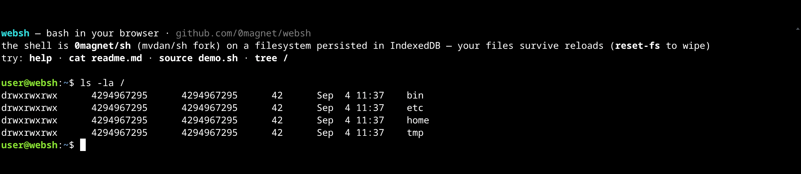
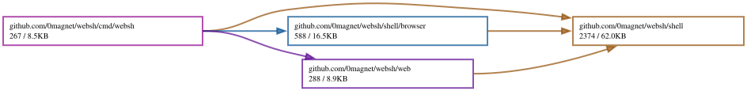

# websh

A bash-like shell running entirely in your browser — no server, no container, no emulator. WebAssembly all the way down.

**[Live demo](https://websh.magnetosphere.net/)** (TinyGo build, 6 MB — the default) · **[standard Go build](https://websh.magnetosphere.net/go/)** (20 MB)



```
user@websh:~$ for i in $(seq 3); do echo line $i; done | grep 2
line 2
user@websh:~$ echo it persists > keep.txt   # survives page reloads
```

## What it is

Three Go libraries composed into one wasm binary:

- **[0magnet/xterm-go](https://github.com/0magnet/xterm-go)** — the terminal (a Go port of xterm.js 6.0.0), rendering with its WebGL renderer.
- **[0magnet/sh](https://github.com/0magnet/sh)** — the shell language (a fork of [mvdan/sh](https://github.com/mvdan/sh)), a real Bash/POSIX interpreter: pipes, redirections, globbing, functions, heredocs, command substitution, arithmetic, control flow.
- **[0magnet/u-root](https://github.com/0magnet/u-root)** — pure-Go userland utilities (currently `pkg/ls` for long-listing format; more as the fork grows js support).

Plus **[0magnet/afero](https://github.com/0magnet/afero)** (an [afero](https://github.com/spf13/afero) fork) providing the filesystem: an in-memory fs wired into the interpreter's open/stat/readdir/access handlers, **persisted to IndexedDB** — your files survive page reloads (`reset-fs` wipes).

## Why forks

The interpreter, userland and filesystem run in an environment upstream doesn't target: no OS pipes, no subprocesses, no `Getwd`, and TinyGo's incomplete `os`/`syscall`. The forks carry those changes without being gated on upstream review — `0magnet/sh` abstracts the runner's stdin so pipelines and heredocs use in-process `io.Pipe` on js/wasm, `0magnet/u-root` has js/tinygo build variants for `pkg/ls`, and `0magnet/afero` drops the `net/http` dependency and shims the `os` functions TinyGo lacks.

## What works

- The shell language: `if`/`for`/`while`/`case`, functions, `$(...)`, `$(( ))`, globs, heredocs, `&&`/`||`, multi-line input with continuation prompts, `source`
- Pipes and redirections against the virtual filesystem
- **`awk`** ([goawk](https://github.com/benhoyt/goawk)) and **`jq`** ([gojq](https://github.com/itchyny/gojq)) — the real things, as pure-Go libraries
- **`sed`**: POSIX sed with the common GNU extensions — line, `$`, `/re/`, `first~step` and range addresses with `!`; `s` (`g`, `p`, Nth, `I`, `&`, `\1`, `\U`…), `p d q n N D P = y a i c r w h H g G x b t T` and `{…}` blocks; `-n -e -f -E -s`, and `-i[SUFFIX]` in place on the virtual filesystem. Regexes are translated to Go's RE2, so a back-reference inside a pattern is the one thing missing
- ~45 applets: `ls cat mkdir rm cp mv touch head tail wc grep sed find cut tr xargs tac nl seq sort uniq tree du stat chmod md5sum sha256sum base64 xxd basename dirname date sleep clear env which uname hostname help imgcat a11y reset-fs` + the interpreter's builtins (`cd pwd echo printf read test exit export unset alias eval pushd popd ...`)
- **Bash's `help`**: `builtin help` lists every builtin with its synopsis in two columns, `builtin help cd` documents one, and a star marks the few that are recognized but not implemented (`bind caller complete compopt fc newgrp suspend ulimit`)
- **Job control**: `sleep 30 &` then `jobs`, `kill %1`, `disown`, `fg`, `bg`. A job is a goroutine, so `kill` cancels it rather than signaling a process, and nothing is ever stopped — there is no terminal to hand a job. Job specs work as in bash: `%1`, `%+`, `%sleep`, `%?leep`
- **`compgen`** (the completions the shell itself knows: `-a -b -c -d -e -f -k -v -W -A`), **`history`** (over the line editor's list, `-c` to clear), **`enable -n`** to turn a builtin off, **`umask`**, **`times`**
- **A text editor**: `edit file` — full-screen, in the spirit of [skywire](https://github.com/skycoin/skywire)'s femto-based `edit` command (Ctrl+S save, Ctrl+Q quit, Ctrl+K cut)
- **A pager**: `less`/`more` (space/b page, j/k line, g/G ends, q quits)
- **The browser console, in the shell**: `js 'document.title'` evaluates JavaScript in the page (promises awaited, objects printed as JSON) and `logs` reads captured `console.*` output — `-f` to follow, `-e` for errors only, `-n N`, `-c` to clear. Pipe it: `logs -e -p | wc -l`
- **Browser superpowers**: `curl` (fetch, CORS applies), `nc` (WebSocket netcat), `download` (vfs file → your Downloads), `upload` (file picker → vfs), `pbcopy`/`pbpaste` (system clipboard)
- Line editing: **tab completion** (commands and paths), history (↑/↓), cursor movement (←/→, Ctrl+A/E), kill (Ctrl+U/K/W), Ctrl+C cancels running commands (`sleep 30` → `^C`), Ctrl+L clears

```
user@websh:~$ curl -s https://api.github.com/repos/0magnet/websh | jq -r .description
bash in your browser: xterm-go + a Go shell interpreter + IndexedDB filesystem, all in WebAssembly
```
- Persistence: the filesystem diffs+flushes to IndexedDB after every command

## ssh

`ssh [-p port] [-i keyfile] [-l user] [-n] [user@]host [command]` is an ssh client ([golang.org/x/crypto/ssh](https://pkg.go.dev/golang.org/x/crypto/ssh)). A page cannot open a TCP connection, so **ssh only works through a Wisp server**: the session is a Wisp TCP stream, and the Wisp server (the same one mosh uses, below) is what connects to the host. Give it with `--wisp URL` or `$WISP_URL`.

```
user@websh:~$ export WISP_URL=wss://wisp.example.net/
user@websh:~$ ssh me@remote.example.net
user@websh:~$ ssh -p 2222 me@remote.example.net uptime
```

Passwords and keyboard-interactive prompts are read without echo. Keys come from websh's filesystem: `-i FILE`, then `~/.ssh/id_ed25519`, `id_ecdsa` and `id_rsa` (`upload` brings one in); an encrypted key asks for its passphrase. Host keys are checked against `~/.ssh/known_hosts`: an unknown host is shown by fingerprint and asked about, as OpenSSH does, and a changed key is refused. Without a command you get a login shell on a pty that follows the terminal's size; `~.` at the start of a line disconnects. With a command, its stdout, stderr and exit status come back (`-n`: send it no stdin).

## mosh

`mosh` connects to a [mosh](https://mosh.org/) server from the browser. A page cannot send UDP, so mosh's datagrams ride a [Wisp](https://github.com/MercuryWorkshop/wisp-protocol) UDP stream instead, and a Wisp server sends them on as real UDP. The protocol is [mosh-go](https://github.com/unixshells/mosh-go); the transport is [0magnet/wisp](https://github.com/0magnet/wisp).

Any Wisp v2 server with the UDP extension will do, such as skywire's:

```bash
skywire cli wisp serve
```

or a few lines of Go:

```go
srv, _ := wisp.NewServer(wisp.Config{Egress: &wisp.DirectEgress{}}) // github.com/0magnet/wisp
http.ListenAndServe(":8090", srv)                                   // ws://HOST:8090/
```

With no `--key`, `mosh user@host` does what the real mosh script does: it logs in with `ssh` through the same Wisp server, runs `mosh-server new -c 256 -s -l LANG=...` there, and connects to the port and key from its `MOSH CONNECT` line. `--ssh-port` picks the ssh port.

```
user@websh:~$ export WISP_URL=wss://wisp.example.net/
user@websh:~$ mosh me@remote.example.net
```

Or start the server yourself and give `mosh` what its `MOSH CONNECT` line says:

```
remote$ mosh-server new
MOSH CONNECT 60001 4NeCCgvZFe2RnPgrcU1PQw

user@websh:~$ export WISP_URL=wss://wisp.example.net/
user@websh:~$ mosh --port 60001 --key 4NeCCgvZFe2RnPgrcU1PQw remote.example.net
user@websh:~$ mosh remote.example.net MOSH CONNECT 60001 4NeCCgvZFe2RnPgrcU1PQw   # or paste the line
```

`--wisp URL` overrides `$WISP_URL`, and `$MOSH_KEY` stands in for `--key`. The host is resolved and reached by the Wisp server, not by the browser. Ctrl-^ then `.` quits. `mosh` is in the standard Go build only (`/go/`): mosh-go's terminal model needs `hash/maphash`, which TinyGo 0.42 cannot compile against Go 1.27, and against Go 1.26 it builds, but some ten times slower: go-runewidth's init writes into a 2 MB per-rune table, which stock TinyGo's compile-time interpreter serializes in quadratic time (fixed in the [0magnet/tinygo](https://github.com/0magnet/tinygo) fork, not yet upstream).

## Images and widgets over the terminal

A program in websh can show real images and page-provided widgets by
writing an escape sequence, OSC 7337, like OSC 8 makes a link. It is output
like any other, so it also works from a program on the far end of an ssh or
dmsg session, and a terminal that does not know it ignores it. Each `<data>`
is base64 of a JSON object. The verbs:

- **Placing:** `place` lays an image (`"url"`, with `"fit"`: `contain`, `cover` or `fill`) or a widget (`"widget"`) over the cells `{"row","col","w","h"}`, borderless; `remove` and `clear` take placements away.
- **Windows:** `view` shows `{"url","title"}` in a window over the shell, unless the person closed it; `open` shows it even then; `close` closes it.
- **Discovery:** `caps?` asks what the host offers.
- **Widgets:** `ship` sends html or wasm widgets to run sandboxed; `post` and `event` carry messages to a widget and what happens to it back.
- **The page:** `font` brings a font, `page` sets the address and title (and handles deep links, `#run=...&at=`), `icon` sets the favicon, `sound` plays audio.
- **Input and access:** `listen` asks for file drops, `mirror` publishes an accessible rendition of what is shown.

[PROTOCOL.md](PROTOCOL.md) has the data each takes.

A placement takes no input unless it asks with `"input": true`: then the mouse
over it goes to it (a widget can be dragged or zoomed, say) and not to the
program, which keeps the keys. What a command placed is taken away when it ends. A widget is one the page
registers with `web.RegisterWidget(name, mount)`, or one a program run from
the filesystem offers from its own process with `widget.Register` (below).

### Standard sequences

Beyond OSC 7337, websh honors what other terminals do: OSC 0/2 titles, OSC 8 links, OSC 52 clipboard (a read asks the person first), OSC 9, 777 and 99 notifications, OSC 1337 `File=` downloads and inline images, kitty graphics (APC `G`), sixel, the kitty keyboard protocol, OSC 22 pointer shapes, OSC 4/10/11/12 color queries, XTVERSION, CSI 14/16/18 t, and focus reporting (mode 1004). The shell marks its prompts with OSC 133, so Ctrl+Shift+Up and Ctrl+Shift+Down jump between them and Ctrl+Shift+O copies the last command's output. `imgcat` shows pictures inline.

### Screen reader, touch and file drop

`a11y on` and `a11y off` switch screen reader mode (an accessibility tree and a live region for output); the choice is kept in this browser's localStorage. On a touch screen a key bar sits under the terminal: Esc, Tab, Ctrl, Alt, the arrows, Home, End, PgUp, PgDn and `| ~ / -`. Ctrl and Alt latch for one key when tapped once and stay on when tapped twice; volume-down latches Ctrl where the browser passes it on. Files dropped onto the terminal are saved to `~/Downloads` and their paths typed at the cursor, or sent to a program that asked with `listen`.

## Programs from the filesystem

A wasm program on the PATH runs as a process of its own (bottle's `proc`),
built by Go or by TinyGo, as a program runs in a terminal: its output appears
as it is written, what is typed reaches its stdin, and Ctrl+C stops it. With
its stdout on the terminal it has a terminal of its own — the size, resizes,
raw mode — so a full-screen program works: `childtty.NewScreen()` is a tcell
screen on it. Widgets it offers are withdrawn when it exits.

Such a program is a **progressive terminal** program: a terminal program first,
which asks its host for more over its own output and becomes more where the
host can do it. [PROTOCOL.md](PROTOCOL.md) is the protocol: the program asks
what the host offers (`progressive.Probe`, which `childtty` runs), lays
pictures and its own widgets over its cells, and talks with those widgets
both ways — what happens to them arrives on its input as events, and it
posts messages back.

```sh
curl -o /bin/ttydemo https://websh.magnetosphere.net/bin/ttydemo.wasm
ttydemo
```

`cmd/ttydemo` is that program: tcell cells, keys, resizes, what the host
answered, and a widget of its own over a box of its cells whose button the
program counts and answers.

`cmd/progdemo` shows the whole protocol, each part beside what the same
program does where the host cannot: what the host answered, a picture in
cells and as an image (kitty's graphics, which websh and kitty both draw), a
shipped slider that drives the program's cells while the arrow keys drive the
slider, the page's title and address (each demo page has a link of its own),
media, and the mirror a screen reader is given. It is one program for every
terminal: run it from websh's filesystem, or build it natively and run it in
kitty, in a plain terminal, or over ssh into websh, where the remote rules
show. `childtty` gives it the same probe and events natively, on `/dev/tty`.

```sh
curl -o /bin/progdemo https://websh.magnetosphere.net/bin/progdemo.wasm
progdemo
```

## Architecture

```
cmd/websh/       js/wasm entry: terminal wiring, prompt, IndexedDB persistence
web/             the host (js/wasm): session, the OSC 7337 protocol, placements,
                   key bar, file drop, screen reader mode
progressive/     the program side, pure Go: Probe, Filter, Place, Ship, Font,
                   Page, Mirror, Image, Notify, Copy...
widget/          offer a widget from a program run from the filesystem
widget/inside/   for Go running as a shipped widget: talk to the program
childtty/        a program's terminal as a tcell Tty, under bottle's proc
cmd/ttydemo/     demo program; cmd/wasmwidget is the widget it ships
cmd/progcheck/   reports what any terminal answers, progressive or not
shell/           pure Go, natively testable (go test ./shell/):
  shell.go         interp.Runner + afero handlers (open/stat/readdir/access/exec)
  applets.go       the userland, written against afero
  editor.go        readline-style line discipline (escape-seq parser, history)
shell/browser/   js/wasm applets any embedder can turn on with browser.Register():
  browser.go       js, download, upload, curl, nc, pbcopy, pbpaste
  console.go       console.* capture behind `logs` (chains with a host page's
                   own capture, and backfills from it)
shell/sed/       the sed engine, on io.Reader/io.Writer
shell/mosh/      mosh over a Wisp UDP stream; mosh.Register() adds the command
shell/ssh/       ssh over a Wisp TCP stream; ssh.Register() adds the command
```

Embedders get the browser applets by importing one package:

```go
import "github.com/0magnet/websh/shell/browser"

browser.Register()   // before sh.PopulateBin(), so they appear in /bin
```

The `shell` package has no `syscall/js` — the whole engine (interpreter, filesystem, applets, line editor) runs and is tested natively. The wasm layer is only terminal glue.

## Building

`./build.sh` builds everything into `docs/`, which GitHub Pages serves: `./build.sh tinygo`, `go` or `demo` builds one part. It copies bottle's `jsfs.js`, `vnet.js` and `proc.js` at the version go.mod names, stamps `web.Version` (what programs are told) from `git describe`, and builds the TinyGo page (6 MB), the standard Go page (20 MB, `docs/go/`) and the programs run from the filesystem (`ttydemo`, `wasmwidget`, `progcheck`, in `docs/bin/`). The raw commands:

```bash
tinygo build -target wasm -no-debug -o docs/main.wasm ./cmd/websh
GOOS=js GOARCH=wasm go build -o docs/go/main.wasm ./cmd/websh
```

Both toolchains are supported and both are deployed ([TinyGo](https://websh.magnetosphere.net/), [standard Go](https://websh.magnetosphere.net/go/)); the forks carry the TinyGo compatibility shims. Use the matching `wasm_exec.js` for whichever compiled the binary.

## Roadmap

- More u-root applets as the fork gains js/wasm build support
- Literal femto/tview support would need a rename-chain of forks (tcell's tty screen is excluded from js builds); the current `edit` keeps femto's keybindings without the dependency chain

## License

MIT (websh). The forks retain their upstream licenses: sh (BSD-3-Clause), u-root (BSD-3-Clause), afero (Apache-2.0), xterm-go (MIT).

## Related projects

Other shells and Unix environments that run in the browser:

- [Shiro](https://shiro.computer/show) — a Unix environment in a single HTML file, with a bash-like interpreter and IndexedDB persistence
- [wasi-sh](https://github.com/alganet/wasi-sh) — busybox ash and coreutils on wasm32-wasi, in the browser and Node
- [Wanix](https://wanix.dev/) — WebAssembly-native Unix sandboxing with Plan 9-style namespaces
- [BrowserPod](https://labs.leaningtech.com/blog/browserpod-20) — in-browser WebAssembly sandboxes running bash, git, Node and Python

## Dependency Graph

Made with [goda](https://github.com/loov/goda):

```
# GOOS=js: the import edges of a wasm program live in js/wasm-tagged
# files and are invisible to a host-context run
GOOS=js GOARCH=wasm go run github.com/loov/goda@latest graph github.com/0magnet/websh/... | dot -Tsvg -o docs/websh-goda-graph.svg
```



## Lines of Code

Made with [gocloc](https://github.com/hhatto/gocloc) (excludes `vendor/`, `node_modules/`, `.git/`):

```
gocloc --not-match-d='(vendor|node_modules|\.git)' .
```

```
-------------------------------------------------------------------------------
Language                     files          blank        comment           code
-------------------------------------------------------------------------------
Go                              83           1093           2238          11888
JavaScript                       5            266            663           2844
Markdown                         2            158              0            556
Makefile                         1             21             52            111
HTML                             2              0             10             99
YAML                             1              0              7             98
Bourne Shell                     2             16             37             64
JSON                             1              0              0              8
XML                              1              0              0              4
Plain Text                       1              1              0              3
-------------------------------------------------------------------------------
TOTAL                           99           1555           3007          15675
-------------------------------------------------------------------------------

```
